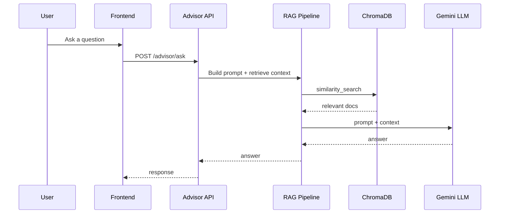

# DDD Architecture - AI_Carreer Backend

## Scope
This document maps the existing `AI_Carreer` backend (RAG chatbot) into a DDD structure and shows how it should integrate with the frontend flow defined in `AI_Carreer_FE/CONTEXT.md`.

## Current Backend Summary
- `embed.py`: data ingestion + chunking + embedding + ChromaDB persistence.
- `chatbot.py`: RAG chatbot with quiz state machine and Gemini LLM via LangChain.
- Data sources: `data.json`, `data_2.json`.
- Vector store: `chroma_db/`.

## Bounded Contexts (Backend)
- Knowledge Ingestion: build vector database from structured content.
- AI Advisor (RAG): retrieve knowledge and answer user questions.
- Quiz Assessment (lightweight): collect quick signals to suggest majors and schools.

## Context Map (Backend + FE)
```mermaid
flowchart LR
  FE[Frontend WebApp] -->|Ask Advisor| Advisor[AI Advisor (RAG)]
  FE -->|Start Quiz| Quiz[Quiz Assessment]
  Ingestion[Knowledge Ingestion] --> Advisor
  Data[(data.json, data_2.json)] --> Ingestion
  VectorDB[(ChromaDB)] --> Advisor
```

## Main Flow (Advisor)


## DDD Mapping (Target Structure)
```
AI_Carreer/
  src/
    domain/
      advisor/
        advisor_session.py
        advisor_message.py
      quiz/
        quiz_state.py
        quiz_result.py
      knowledge/
        document.py
        embedding_model.py
    application/
      use_cases/
        build_vector_db.py
        ask_advisor.py
        run_quiz.py
    infrastructure/
      vector_store/
        chroma_store.py
      llm/
        gemini_client.py
      embeddings/
        hf_embeddings.py
      data_sources/
        json_loader.py
    interfaces/
      cli/
        chatbot_cli.py
      http/
        advisor_api.py
```

## Incremental Refactor Plan
1. Keep `embed.py` and `chatbot.py` running as-is.
2. Extract knowledge ingestion into `application/use_cases/build_vector_db.py`.
3. Extract RAG pipeline into `domain/advisor` + `application/use_cases/ask_advisor.py`.
4. Add a thin HTTP layer (FastAPI) to serve FE: `/advisor/ask`, `/quiz/start`, `/quiz/answer`.

## Integration Points With FE
- `Assessment` + `Results` pages can call `/quiz/*` for quick advisor matching.
- `AIChatAssistant` should call `/advisor/ask` for RAG.
- Roadmap-related questions can be routed to `/advisor/ask` with a roadmap-prefixed prompt.
