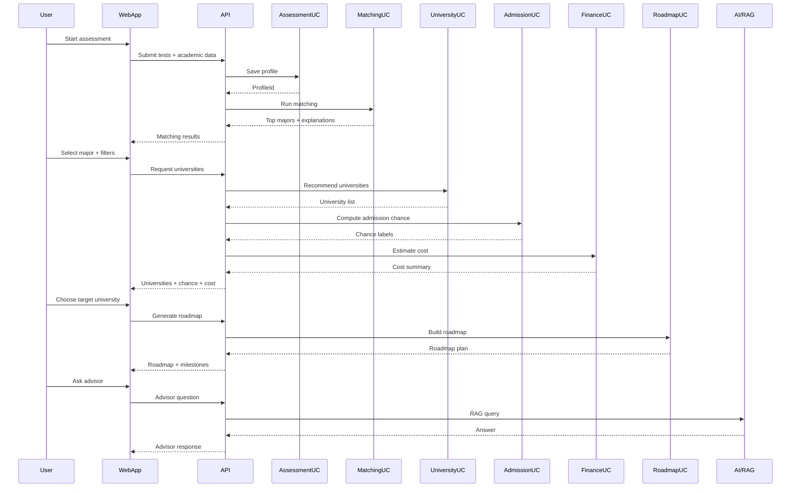

# DDD Architecture

## Scope
This document defines the DDD architecture for the Hanh Trang So platform based on AI_Carreer_FE/CONTEXT.md.

## Bounded Contexts
- Assessment & Profile: capture tests, academic data, and student preferences.
- Career Matching: compute major compatibility and explanations.
- University Catalog: maintain universities, majors, admission scores, and tuition.
- Admission Probability: compare student score to admission history and classify chance.
- Financial Planning: estimate yearly tuition and total 4-year cost.
- Roadmap & Progress: build gap analysis roadmap and track progress.
- AI Advisor (RAG): answer questions using curated knowledge.
- Subscription & Entitlement: gate paid and premium features.

## Context Map
```mermaid
flowchart LR
  Assessment[Assessment & Profile] --> Matching[Career Matching]
  Matching --> University[University Catalog]
  University --> Admission[Admission Probability]
  University --> Finance[Financial Planning]
  Matching --> Roadmap[Roadmap & Progress]
  Admission --> Roadmap
  Roadmap --> Progress[Progress Tracking]
  Assessment --> Advisor[AI Advisor (RAG)]
  University --> Advisor
  Advisor --> Knowledge[Knowledge Base]
  Subscription[Subscription & Entitlement] --> Matching
  Subscription --> University
  Subscription --> Roadmap
  Subscription --> Advisor
```

## Main Flow Sequence


## DDD Rules From CONTEXT.md
- Do not break the main user flow.
- All AI features must support Gap Analysis + Roadmap.
- University recommendations must include admission score, tuition, and location.
- New features must improve student decision making.
